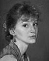

  
Lina Liberace (formerly Lina Chesak) is an illustrator/fine artist living in Northern Virginia. Her colorful, whimsical images are well suited for editorial and institutional illustration as well as for children's books. Her preferred mediums are oil and watercolor with the addition of pencil or ink. Lina has illustrated books including "Polly Hopper's Pouch" written by Louise Bonnett-Rampersaud for Dutton Children's Books, and "Charlie Muffin&'s Miracle Mouse" written by Dick King-Smith for Crown Publishers.
   
Her shepherd Humpty Dumpty image is a part of the Society of Illustrator&#8217;s exhibition and permanent collection, &#8220;Women Illustrators, Past and Present.&#8221; Her images have also been included in the annual exhibition of the Society of Illustrators of Los Angeles. Lina is a member of the Illustrator&#8217;s Club of Washington, Maryland, and Virginia and has received numerous awards in their annual shows. She received a degree in marketing and art from St. Joseph&#8217;s College in Rensselaer, Indiana. In November 2002 she was one of eight alumni selected from the previous 40 years to represent the college in a brochure called <a href="SJCpage.htm">"Success"</a>.  Writer Hope Katz Gibbs wrote an article in 2006 for Elan Magazine on Lina and the balance of career and children in <a href="http://hopegibbs.com/article/309/lina-liberace-the-art-of-motherhood-elan-magazine">"The Art of Motherhood"</a>.

In the past several years, her focus has switched somewhat from illustration to still life painting and whimsical sculpture.

Lina lives with her husband, artist <a href="http://www.robertliberace.com">Robert Liberace</a> and their two daughters. Robert is internationally recognized for his portraits, figure drawing and sculpture.

## Contact

Lina Liberace
703.242.3898 or lina(at)linaliberace.com
To inqure about stock images please contact Lina directly.
portrait by Robert Liberace
All images &copy; Lina Liberace. All rights reserved.
The work on this web site is not intended for duplication without the expressed permission of the artist aside from comping purposes for client presentation.
